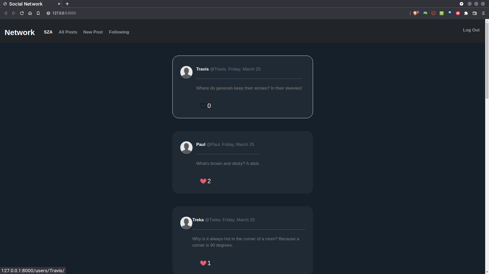

<a name="readme-top"></a>

<div align="center">

  
  <h1>Tweet-It</h1>

  <p>
    People on Tweet it knows it first!
  </p>

<!-- Badges -->
<p>
  <a href="https://github.com/yusufadell/tweet-it/graphs/contributors">
    
  </a>
  <a href="">
    
  </a>
  <a href="https://github.com/yusufadell/tweet-it/network/members">
    
  </a>
  <a href="https://github.com/yusufadell/tweet-it/stargazers">
    
  </a>
  <a href="https://github.com/yusufadell/tweet-it/issues/">
    
  </a>
  <a href="https://github.com/yusufadell/tweet-it/blob/master/LICENSE">
    
  </a>
</p>

<h4>
    <a href="https://github.com/yusufadell/tweet-it/">View Demo</a>
  <span> · </span>
    <a href="https://github.com/yusufadell/tweet-it">Documentation</a>
  <span> · </span>
    <a href="https://github.com/yusufadell/tweet-it/issues/">Report Bug</a>
  <span> · </span>
    <a href="https://github.com/yusufadell/tweet-it/issues/">Request Feature</a>
  </h4>

</div>

<br/>

<!-- Table of Contents -->
# :notebook_with_decorative_cover: Table of Contents

- [:notebook\_with\_decorative\_cover: Table of Contents](#notebook_with_decorative_cover-table-of-contents)
  - [:star2: About Tweet-It](#star2-about-tweet-it)
    - [:camera: Screenshots](#camera-screenshots)
    - [:space\_invader: Tech Stack](#space_invader-tech-stack)
  - [:toolbox: Getting Started](#toolbox-getting-started)
    - [Settings](#settings)
    - [:bangbang: Prerequisites](#bangbang-prerequisites)
  - [Basic Commands](#basic-commands)
    - [Setting Up Your Users](#setting-up-your-users)
    - [Type checks](#type-checks)
    - [:test\_tube: Running Tests](#test_tube-running-tests)
    - [Test coverage](#test-coverage)
      - [Running tests with pytest](#running-tests-with-pytest)
    - [:running: Run Locally](#running-run-locally)
  - [:compass: Roadmap](#compass-roadmap)
  - [:wave: Contributing](#wave-contributing)
    - [:scroll: Code of Conduct](#scroll-code-of-conduct)
  - [:grey\_question: FAQ](#grey_question-faq)
  - [:warning: License](#warning-license)
  - [:handshake: Contact](#handshake-contact)
  - [:gem: Acknowledgements](#gem-acknowledgements)

<p align="right">(<a href="#readme-top">back to top</a>)</p>

<!-- About the Project -->
## :star2: About Tweet-It

People on Tweet it knows it first!

<!-- Screenshots -->
### :camera: Screenshots

<div align="center">
  
</div>

<!-- TechStack -->
### :space_invader: Tech Stack

<details open>
  <summary>Client</summary>
  <ul>
    <li><a href="https://tailwindcss.com/">TailwindCSS</a></li>
  </ul>
</details>

<details open>
  <summary>Server</summary>
  <ul>
    <li><a href="https://docs.djangoproject.com/en/4.1/">Django</a></li>
  </ul>
</details>

<details open>
<summary>Database</summary>
  <ul>
    <li><a href="https://www.mysql.com/">MySQL</a></li>
  </ul>
</details>

<details open>
<summary>DevOps</summary>
  <ul>
    <li><a href="https://www.docker.com/">Docker</a></li>
    <li><a href="https://circleci.com/">CircleCLI</a></li>
  </ul>
</details>

<p align="right">(<a href="#readme-top">back to top</a>)</p>

<!-- Getting Started -->
## :toolbox: Getting Started

* A social network app that allows users :hear_no_evil: to make posts, follow other users, and “like” :heartbeat: posts.

* Signed-in users are able to create a new text-based post by typing into a text box and then clicking a button to submit it .

* The “All Posts” link in the navigation bar send the user to a page where they may see all of the posts from all users, in chronological order.

* In profile detail page you can see the user's total number of followers as well as the number of individuals he or she follows and a user As a matter of course can't follow onself.

* The “Following” link in the navigation bar should send the user to a page where they can see all of the posts made by the individuals they are following.

* Users are able to edit any of their own postings by clicking a "Edit"  button or link.

### Settings

Moved to
[settings](/project4/settings.py).

<!-- Prerequisites -->
### :bangbang: Prerequisites
- Create a Virtual environment

    `python3 -m venv .venv`

- Activate the Virtual environment

    `source .venv/bin/activate`

- Install required packages

    `pip3 install -r requirements.txt`

- Run Migration for Models

    `python3 manage.py migrate --settings=mysite.settings.local`

- Start Development Server

    `python3 manage.py runserver --settings=mysite.settings.local`


Basic Commands
--------------

### Setting Up Your Users

-   To create a **normal user account**, just go to Sign Up and fill out
    the form. Once you submit it, you\'ll see a message that your account cerates succesfully.

-   To create an **superuser account**, use this command:

        $ python manage.py createsuperuser

For convenience, you can keep your normal user logged in on Chrome and
your superuser logged in on Firefox (or similar), so that you can see
how the site behaves for both kinds of users.


<p align="right">(<a href="#readme-top">back to top</a>)</p>

<!-- Running Tests -->
### Type checks

Running type checks with mypy:

```bash
  mypy Tweet-It
```

### :test_tube: Running Tests

To run tests, run the following command

### Test coverage

To run the tests, check your test coverage, and generate an HTML coverage report:

```bash
  coverage run -m pytest\
  coverage html\
  open htmlcov/index.html\
```

#### Running tests with pytest

```basg
  pytest
```

<!-- Run Locally -->
### :running: Run Locally

Clone the project

```bash
  git clone https://github.com/yusufadell/tweet-it.git
```

Go to the project directory

```bash
  cd Tweet-It
```

Install dependencies

```bash
  pip install -r requirements/local.txt
```

Start the server

```bash
  python mananage.py migrate\
  python manage.py runserver
```

<p align="right">(<a href="#readme-top">back to top</a>)</p>


<!-- Roadmap -->
## :compass: Roadmap

- [x] Todo 1
- [ ] Todo 2

See the [open issues](https://github.com/othneildrew/Best-README-Template/issues) for a full list of proposed features (and known issues).

<p align="right">(<a href="#readme-top">back to top</a>)</p>

<!-- Contributing -->
## :wave: Contributing

<a href="https://github.com/yusufadell/tweet-it/graphs/contributors">
  
</a>

Contributions are what make the open source community such an amazing place to learn, inspire, and create. Any contributions you make are **greatly appreciated**.

See `contributing.md` for ways to get started.

If you have a suggestion that would make this better, please fork the repo and create a pull request. You can also simply open an issue with the tag "enhancement".
Don't forget to give the project a star! Thanks again!

1. Fork the Project
2. Create your Feature Branch (`git checkout -b feature/AmazingFeature`)
3. Commit your Changes (`git commit -m 'Add some AmazingFeature'`)
4. Push to the Branch (`git push origin feature/AmazingFeature`)
5. Open a Pull Request

<p align="right">(<a href="#readme-top">back to top</a>)</p>

<!-- Code of Conduct -->
### :scroll: Code of Conduct

Please read the [Code of Conduct](https://github.com/yusufadell/tweet-it/blob/master/CODE_OF_CONDUCT.md)

<!-- FAQ -->
## :grey_question: FAQ

- Question 1

  - Answer 1

- Question 2

  - Answer 2

<p align="right">(<a href="#readme-top">back to top</a>)</p>

<!-- License -->
## :warning: License

Distributed under the no License. See LICENSE.txt for more information.

<!-- Contact -->
## :handshake: Contact

Your Name - [@WHYUSUF_](https://twitter.com/WHYUSUF_) - yusufadell.dev@gmail.com

Project Link: [https://github.com/yusufadell/tweet-it](https://github.com/yusufadell/tweet-it)

<!-- Acknowledgments -->
## :gem: Acknowledgements

Use this section to mention useful resources and libraries that you have used in your projects.

- [Shields.io](https://shields.io/)
- [Awesome README](https://github.com/matiassingers/awesome-readme)
- [Emoji Cheat Sheet](https://github.com/ikatyang/emoji-cheat-sheet/blob/master/README.md#travel--places)
- [Readme Template](https://github.com/othneildrew/Best-README-Template)

<p align="right">(<a href="#readme-top">back to top</a>)</p>
